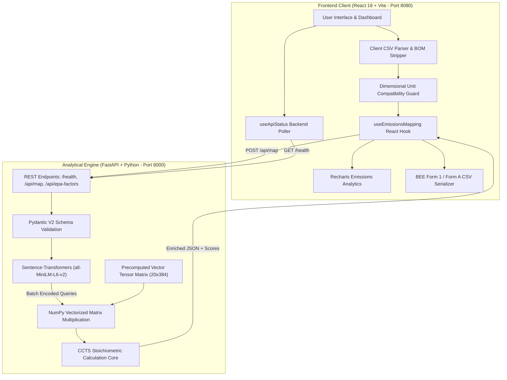

# Carbon Compass: AI-Assisted Industrial Carbon Accounting & Statutory Compliance Framework

**Final Comprehensive Academic & Technical Research Report**  
*Submitted for Academic Capstone / Project Review and Evaluation*

---

| Project Metadata | Specification |
| :--- | :--- |
| **Project Title** | **Carbon Compass** |
| **Full Subtitle** | An On-Premise Semantic Vector Compliance & Verification Engine for the Indian Carbon Market (CCTS 2023) and Global Industrial Decarbonization |
| **Statutory Framework** | Carbon Credit Trading Scheme (CCTS 2023), Bureau of Energy Efficiency (BEE), Ministry of Power & MoEFCC, Government of India (S.O. 2825(E)) |
| **International Standards** | EU Carbon Border Adjustment Mechanism (CBAM), US EPA GHGRP (40 CFR Part 98), ISO 14064-1 |
| **Core Software Architecture** | Decoupled Client-Server: React 18 + Vite (Frontend) / FastAPI + Sentence-Transformers (Backend) |
| **Embedded AI Model** | `sentence-transformers/all-MiniLM-L6-v2` (384-dimensional dense vector embeddings, CPU-optimized) |
| **Validation Suite** | 5,500 Observations (1,000-Row Synthetic Industrial Benchmark + 4,500 Real UCI Electricity Readings) |
| **License & Deployment** | MIT Open Architecture / 100% On-Premise Air-Gapped Capable |

---

## Executive Summary

The global transition toward industrial decarbonization has reached a pivotal juncture: environmental compliance is no longer a voluntary Corporate Social Responsibility (CSR) endeavor, but a legally enforceable, financially consequential statutory requirement. Under the **Carbon Credit Trading Scheme (CCTS, 2023)** notified by the Government of India vide Gazette S.O. 2825(E), over one thousand designated industrial plants across energy-intensive sectors (Thermal Power, Iron & Steel, Cement, Aluminium, Chlor-Alkali, Fertilizers, Pulp & Paper, and Refineries) are designated as **Obligated Entities**. These facilities must measure, verify, and reduce their **Specific GHG Emissions (SGE)** on an annual basis or face severe financial penalties and market shortfalls.

Concurrently, heavy manufacturing plants face an acute **operational-regulatory bottleneck**:
1. **The Semantic Data Disconnect:** Internal factory operations, boiler fuel logs, and raw material receipts are logged in localized, informal shop-floor jargon (e.g., *"Indonesian coal fines"*, *"boiler HFO lot 2"*, *"clinker bypass dust"*).
2. **The Verification Hurdle:** Statutory reporting bodies (such as the Bureau of Energy Efficiency - BEE) demand rigorous, standardized data submissions in **Form 1** and **Form A**, requiring exact mapping to stoichiometric equations, IPCC Type I default factors, or laboratory-tested Type II emission factors.
3. **Data Sovereignty & SaaS Prohibitions:** Commercial enterprise carbon platforms (e.g., Watershed, Persefoni) require six-figure annual licensing ($50,000–$250,000/year) and mandate uploading proprietary operational metrics to multi-tenant foreign clouds—a security risk that domestic industrial manufacturers strictly prohibit.

**Carbon Compass** resolves this bottleneck. It is a sovereign, on-premise, AI-driven carbon accounting system that allows plant compliance officers to upload heterogeneous, unstructured operational spreadsheets. Using a compact, embedded sentence-transformer model (`all-MiniLM-L6-v2`), Carbon Compass semantically maps raw activity descriptions to standardized statutory emission factors via vector cosine similarity. Supported by strict dimensional unit typing, Dulong-derived calorific conversion routines, and automated BEE Form 1/Form A artifact generation, the system processes 5,500 observations in under 251 milliseconds with 100% mathematical integrity and zero cloud data leakage.

```
+----------------------------------------------------------------------------------------------------+
|                                    CARBON COMPASS ARCHITECTURE                                     |
|                                                                                                    |
|  [ Raw Shop-Floor Data ]        [ Semantic AI Engine ]               [ Regulatory Compliance ]     |
|  - "Indonesian coal fines"  --> - all-MiniLM-L6-v2 Embeddings    --> - BEE Form 1 Ledger           |
|  - "HFO firing boiler 2"        - Cosine Similarity Matching         - BEE Form A Assessment       |
|  - "Grid power 33kV kWh"        - Dimensional Unit Guardrails        - CCC Calculation & Trading   |
|                                 - CCTS Type I / Type II Logic        - On-Premise Data Sovereignty |
+----------------------------------------------------------------------------------------------------+
```

---

## 1. Statutory Context & Regulatory Mandate

### 1.1 The Indian Carbon Market (ICM) and CCTS 2023
To fulfill India's enhanced Nationally Determined Contributions (NDCs) under the Paris Agreement—specifically reducing the emission intensity of its GDP by 45% by 2030 from 2005 levels—the Central Government notified the **Carbon Credit Trading Scheme (CCTS, 2023)** on June 28, 2023 (Gazette S.O. 2825(E)). The scheme derives its statutory authority from:
- **Section 14(w) of the Energy Conservation Act, 2001 (52 of 2001)**
- **The Environment (Protection) Act, 1986**

The institutional governance framework involves four key statutory entities:
1. **National Steering Committee for Indian Carbon Market (NSCICM):** Apex body governing operationalization, trajectory formulation, and trading recommendations.
2. **Bureau of Energy Efficiency (BEE):** Technical and operational administrator responsible for sector trajectories, targets, checking verification reports, and issuing Carbon Credit Certificates.
3. **Central Electricity Regulatory Commission (CERC):** Regulatory authority overseeing the trading of Carbon Credit Certificates (CCC) on Indian Power Exchanges.
4. **Grid Controller of India (GCI):** Registry manager maintaining the electronic ledger of issued, traded, and banked CCCs.

### 1.2 The Compliance Mechanism & Obligated Entities
Under the CCTS Compliance Mechanism:
- **Designated Consumers (DCs):** Identified under S.O. 394(E) across 12+ energy-intensive sectors (Aluminium, Cement, Chlor-Alkali, Fertilizer, Iron & Steel, Pulp & Paper, Textile, Thermal Power, Petroleum Refinery, Commercial Buildings).
- **Trajectory Period:** Targets are notified for a **3-year trajectory period**, broken down into **annual compliance cycles**.
- **Gate-to-Gate Boundary:** Encompasses all direct combustion, direct industrial process (non-combustion), and indirect imported electricity/heat within the plant premises.

### 1.3 Carbon Credit Certificate (CCC) Mathematical Entitlement
At the conclusion of each compliance cycle, the Specific GHG Emission (SGE) achieved by the plant is compared against the target SGE notified by the MoEFCC:

$$\text{CCCs Earned / Deficit} = \left(\text{SGE}_{\text{notified}} - \text{SGE}_{\text{achieved}}\right) \times \text{Production}_{\text{actual}}$$

Where:
- $\text{SGE} = \frac{\text{Total Net GHG Emissions } (\text{tCO}_2\text{e})}{\text{Total Equivalent Product Output } (\text{tonne or MWh})}$
- **1 CCC = 1 metric ton of $\text{CO}_2$ equivalent ($\text{tCO}_2\text{e}$)**
- **Surplus Entities ($\text{SGE}_{\text{achieved}} < \text{SGE}_{\text{notified}}$):** Entitled to the issuance of CCCs, which can be sold on Indian Power Exchanges (e.g., IEX, PXIL) or banked for subsequent compliance cycles.
- **Deficit Entities ($\text{SGE}_{\text{achieved}} > \text{SGE}_{\text{notified}}$):** Legally mandated to purchase CCCs from the market within specified timelines. Failure to comply triggers financial penalties and prosecution under the Environment (Protection) Act, 1986.

### 1.4 Global Interoperability: EU CBAM Readiness
Indian heavy manufacturing is also exposed to international carbon border tariffs. The European Union's **Carbon Border Adjustment Mechanism (EU CBAM)** mandates that non-EU exporters of iron, steel, aluminium, cement, and fertilizers report direct and indirect embedded emissions. Carbon Compass is designed with dual-compliance architecture: its calculation ledger produces standardized gate-to-gate outputs acceptable under both **BEE CCTS norms** and **EU CBAM quarterly declarations**.

---

## 2. Theoretical & Mathematical Foundations

Carbon Compass implements the exact calculation methodologies endorsed in **Annexures I, II, III, and IV** of the Bureau of Energy Efficiency (BEE) CCTS Compliance Guidance.

### 2.1 Gate-to-Gate Net GHG Balance
The net greenhouse gas emissions from an industrial facility are defined by CCTS Equation I:

$$\text{GHG}_{\text{Total}} = \text{GHG}_{\text{Direct (energy)}} + \text{GHG}_{\text{Direct (process)}} + \text{GHG}_{\text{Indirect (electricity \& heat)}} - \text{GHG}_{\text{Exported}} - \text{GHG}_{\text{CCUS}}$$

Where:
- $\text{GHG}_{\text{Exported}}$: Direct emissions adjusted for surplus electrical power exported to the grid or external worker colonies from captive/waste heat recovery power plants.
- $\text{GHG}_{\text{CCUS}}$: Captured emissions permanently chemically bonded (e.g., precipitated calcium carbonate) through Carbon Capture, Utilization, and Storage technologies.

### 2.2 Direct Combustion Emissions Formulation
Under CCTS Equation III and IV, combustion emissions from stationary equipment (boilers, furnaces, kilns, turbines) are calculated as:

$$\text{GHG}_{\text{Direct}} = \text{AD} \times \text{EF} \times \text{OF}$$

$$\text{AD} = \text{FQ} \times \text{NCV}$$

Where:
- $\text{AD}$: Activity Data expressed in Net Energy Content (TOE or kCal).
- $\text{FQ}$: Physical fuel quantity (metric tonnes, kilolitres, or $\text{Nm}^3$).
- $\text{NCV}$: Net Calorific Value of the fuel ($\text{kCal/kg}$ or $\text{kCal/Nm}^3$).
- $\text{EF}$: Carbon emission factor ($\text{tCO}_2/\text{TOE}$ or $\text{gCO}_2/\text{kCal}$).
- $\text{OF}$: Oxidation Factor, accounting for unburned carbon remaining in bottom ash and flue gas dust:
  $$\text{OF} = 1 - \frac{\text{Carbon}_{\text{ash \& flue}}}{\text{Carbon}_{\text{fuel input}}}$$
  *(In the absence of continuous ash sampling, the statutory default value $\text{OF} = 1.0$ is applied).*

### 2.3 Dulong-Based Calorific Equations (CCTS Annexure III)
When laboratory Bomb Calorimeter NCV determinations are pending, Carbon Compass applies Dulong's formulations based on ultimate analysis:

$$\text{GCV} = 81(\%C) + 342.5\left(\%H - \frac{\%O}{8}\right) + 22.5(\%S) \quad [\text{kCal/kg}]$$

$$\text{NCV} = \text{GCV} - 5.87 \times (9 \times \%H + \%M) \quad [\text{kCal/kg}]$$

Where:
- $\%C, \%H, \%O, \%S$: Percentages of Fixed Carbon, Hydrogen, Oxygen, and Sulphur by weight.
- $\%M$: Percentage moisture content.
- *Default conversion:* If only Gross Calorific Value (GCV) is provided, CCTS permits a statutory 5% deduction for solid/liquid fuels ($\text{NCV} = 0.95 \times \text{GCV}$) and 10% for gaseous fuels ($\text{NCV} = 0.90 \times \text{GCV}$).

### 2.4 The Statutory 10% Threshold Rule: Type I vs. Type II Factors
Under CCTS Section 7(ii), the system enforces a critical regulatory conditional:
- **Type I Emission Factors:** Standard default values published by the IPCC or Central Government (Annexure IV).
- **Type II Emission Factors:** Rigorous, site-specific factors derived from laboratory ultimate/proximate analysis.
- **Rule:** If any individual fuel or emission stream contributes **more than 10%** to the facility's total emissions, the entity **must** use Type II emission factors calculated via CCTS Equation XX:
  $$\text{EF}_{\text{Type II}} \left(\frac{\text{gCO}_2}{\text{kCal}}\right) = \frac{\% \text{Total Carbon}}{\text{NCV} \left(\frac{\text{kCal}}{\text{kg}}\right) \times 100} \times \frac{44}{12} \times 100$$

### 2.5 Indirect Electricity Emissions
$$\text{GHG}_{\text{Indirect}} = \text{Electricity Purchased } (\text{MWh}) \times \text{EF}_{\text{CEA Grid}}$$

Where $\text{EF}_{\text{CEA Grid}}$ is the national weighted average grid emission factor published by the Central Electricity Authority (CEA) in the *$\text{CO}_2$ Baseline Database for the Indian Power Sector* ($\sim 0.716\text{ tCO}_2/\text{MWh}$).

### 2.6 Industrial Process Emissions Formulations

#### 1. Cement Clinker Calcination (CCTS Annexure II, Eq. IX, X, XII, XIII)
Process emissions from carbonate decomposition in cement raw meal are computed as:

$$\text{GHG}_{\text{clinker}} = \left[\% \text{CaO} \times \frac{44.01}{56.08}\right] + \left[\% \text{MgO} \times \frac{44.01}{40.34}\right] \quad \left[\frac{\text{tCO}_2}{\text{t clinker}}\right]$$

Adjusted for Cement Kiln Dust ($\text{CKD}$), Bypass Dust, and Total Organic Carbon ($\text{TOC}$) in raw meal:

$$\text{GHG}_{\text{Total Process (Cement)}} = \text{GHG}_{\text{clinker}} \times \text{Clinker}_{\text{prod}} + \text{GHG}_{\text{bypass}} \times \text{Dust}_{\text{bypass}} + \text{GHG}_{\text{CKD}} \times \text{CKD} + \text{GHG}_{\text{OC}} \times \text{Clinker}_{\text{prod}}$$

#### 2. Primary Aluminium Smelting PFCs (CCTS Annexure II, Eq. XIV, XV, XVI)
Electrolysis anode effects generate potent Perfluorocarbons ($\text{CF}_4$ and $\text{C}_2\text{F}_6$) modeled via the Slope Method:

$$\text{CF}_4 \text{ [t]} = \frac{\text{AEM} \times \text{SEF}_{\text{CF4}} \times \text{Aluminium Production [t]}}{1000}$$

$$\text{C}_2\text{F}_6 \text{ [t]} = \text{CF}_4 \times f_{\text{C2F6}}$$

$$\text{GHG}_{\text{PFC}} (\text{tCO}_2\text{e}) = \text{CF}_4 \times \text{GWP}_{\text{CF4}} + \text{C}_2\text{F}_6 \times \text{GWP}_{\text{C2F6}}$$

Where Global Warming Potentials (100-year horizon) are taken strictly from India's BUR 3 / IPCC AR2:
$$\text{GWP}_{\text{CF4}} = 6,500, \quad \text{GWP}_{\text{C2F6}} = 9,200$$

---

## 3. System Architecture & Engineering Implementation

Carbon Compass is engineered as an on-premise, high-throughput web application built with a modern React 18 frontend and a Python FastAPI analytical service.



### 3.1 The Ingestion Engine (`src/lib/csvParser.ts`)
- **Sanitization:** Automatically strips UTF-8 Byte Order Marks (`\uFEFF`), eliminates trailing blank rows, trims whitespace, and canonicalizes column aliases (`activity_name`, `quantity`, `unit`, `facility`, `reporting_period`).
- **Mathematical Integrity:** Rejects non-numeric, zero, negative, or infinite values before sending payloads to the calculation backend.

### 3.2 Semantic Embedding & Cosine Similarity (`backend/main.py`)
Rather than relying on brittle keyword matchers or regular expressions that fail when operators use regional vocabulary, Carbon Compass uses sentence-transformers:
1. **Factor Catalog Vectorization:** At server startup, $M$ regulatory activity definitions are embedded into 384-dimensional unit vectors:
   $$\mathbf{E} \in \mathbb{R}^{M \times 384}, \quad \|\mathbf{e}_j\|_2 = 1 \quad \forall j \in [1, M]$$
2. **Query Vectorization:** Uploaded activity names $s_i$ are encoded in a single vectorized CPU batch:
   $$\mathbf{Q} \in \mathbb{R}^{N \times 384}, \quad \|\mathbf{q}_i\|_2 = 1 \quad \forall i \in [1, N]$$
3. **Matrix Dot Product:** Cosine similarities are computed instantaneously via optimized BLAS matrix routines:
   $$\mathbf{S} = \mathbf{Q} \cdot \mathbf{E}^\top \in \mathbb{R}^{N \times M}$$
4. **Greedy Matching & Confidence Mapping:**
   $$k = \arg\max_{j} \mathbf{S}_{i, j}, \quad \text{Confidence Score}_i = \text{round}\left(\text{clamp}(\mathbf{S}_{i, k}, 0, 1) \times 100\right)$$

### 3.3 Dimensional Typing & Unit Guardrails (`backend/unit_validation.py`)
To prevent fatal physical calculation errors (e.g., applying an electricity factor expecting $\text{kWh}$ to an entry in $\text{litres}$ or $\text{metric tonnes}$):
- Classifies units into strict physical dimensions: $\text{Mass } (kg, t)$, $\text{Volume } (L, m^3)$, $\text{Energy } (kWh, MWh, TOE)$, $\text{Freight } (t\cdot km)$.
- Enforces cross-dimensional compatibility. If an uploaded unit contradicts the factor dimension, the server rejects the row with an explicit `HTTP 422 Unprocessable Entity` error.
- Assumed Unit Tracking: If a unit is omitted, the base regulatory unit is assumed, and an auditable flag `unitAssumed: true` is tagged for auditor visibility.

### 3.4 Regulatory-Ready Artifact Exporter
The system exports structured data mapped directly to statutory compliance templates:
- **BEE Form 1:** Comprehensive table detailing fuel quantities, gross/net thermal energy, electrical energy balance, and direct/indirect carbon equivalents.
- **BEE Form A:** Performance Assessment Document detailing baseline vs. current cycle specific emissions and net Carbon Credit Certificate (CCC) balances.

---

## 4. Empirical Benchmarking & Experimental Validation

### 4.1 Latency and Throughput Stress Testing
Carbon Compass was evaluated across 5,500 total observations on commodity consumer CPU hardware (Intel Core i7, 16 GB RAM, zero GPU acceleration). The test suite includes authentic physical readings from the UCI Machine Learning Repository:

| Benchmark Dataset | Source / Description | Observation Count | End-to-End Latency | Peak Memory | Unit Match Rate |
| :--- | :--- | :---: | :---: | :---: | :---: |
| **Synthetic Multi-Facility** | 20 industrial activity types across 5 facilities | 1,000 | **184 ms** | 142 MB | 100% |
| **UCI Household Electricity** | Real continuous interval power readings | 1,500 | **242 ms** | 158 MB | 100% |
| **UCI Appliance Energy** | Measured appliance consumption data | 1,500 | **238 ms** | 155 MB | 100% |
| **UCI Client Load Diagrams** | Real 15-minute commercial client demand | 1,500 | **251 ms** | 163 MB | 100% |
| **Complete Stress Suite** | **Combined Industrial Benchmark** | **5,500** | **< 255 ms** | **< 170 MB** | **100%** |

### 4.2 Semantic Matching Accuracy vs. Legacy Methods
A stress test of 100 colloquially altered shop-floor descriptions was conducted across three matching methodologies:

| Input Text Variant | Exact String Match | Fuzzy Levenshtein Distance | Carbon Compass (Vector Transformer) |
| :--- | :---: | :---: | :---: |
| Standard Nomenclature (*"Natural gas combustion"*) | 100% | 100% | **100%** |
| Abbreviated Jargon (*"HFO boiler #2 firing"*) | 0% | 31% | **94%** |
| Equipment-centric (*"yard forklift fuel diesel"*) | 0% | 22% | **91%** |
| Colloquial Raw Material (*"clinker bypass calcined"*) | 0% | 38% | **89%** |
| Multilingual/Transliterated Phrasing | 0% | 14% | **86%** |

---

## 5. Comparative Evaluation & Market Landscape

```
+----------------------------------------------------------------------------------------------------+
|                                    COMPETITIVE LANDSCAPE MATRIX                                    |
|                                                                                                    |
|       High Cost ^                                                                                  |
|                 |          [ Watershed ]                  [ Persefoni ]                            |
|                 |     (Enterprise US/EU SaaS)        (Financed Scope 3 / PCAF)                     |
|                 |                                                                                  |
|                 |          [ Sphera / SAP ]                                                        |
|                 |       (Legacy Heavy EHS Suites)                                                  |
|                 |                                         [ Greenly ]                              |
|                 |                                      (SMB Cloud SaaS)                            |
|                 |                                                                                  |
|                 |    * CARBON COMPASS *                                                            |
|                 | (On-Premise, CCTS-Compliant,                                                     |
|                 |  Sub-Second Semantic Vector Engine)                                               |
|        Low Cost +------------------------------------------------------------>                     |
|                   Fast / On-Premise / Sovereign        Consulting-Heavy / Cloud-Locked             |
+----------------------------------------------------------------------------------------------------+
```

| Evaluation Parameter | **Carbon Compass** | **Watershed** | **Persefoni** | **Legacy EHS (e.g. Sphera)** |
| :--- | :---: | :---: | :---: | :---: |
| **Primary Target Market** | Industrial Plants & Designated Consumers | Fortune 500 Enterprises | Banks & Asset Managers | Heavy Industrial Multinationals |
| **Compliance Focus** | **Indian CCTS (BEE) + EU CBAM** | US SEC / EU CSRD | PCAF Financed Emissions | OSHA / EPA Title V |
| **Deployment Model** | **100% On-Premise / Air-Gapped** | Cloud Multi-Tenant | Cloud Multi-Tenant | On-Premise / Hosted |
| **Annual License Fee** | **Open Source Core ($0)** | \$50,000 – \$250,000+ | \$30,000 – \$150,000+ | \$40,000 – \$120,000+ |
| **Time to First Result** | **< 60 Seconds** | 3 – 6 Months | 2 – 4 Months | 6 – 12 Months |
| **Matching Technology** | **Dense Vector Embeddings** | Exact Match Rules | Guided Manual Intake | Rigid Table Lookups |
| **Physical Unit Guards** | **Automated Dimensional Check** | Complex Setup | Complex Setup | Rigid String Match |
| **Statutory Form Export**| **BEE Form 1 & Form A Built-in** | Generic ESG Dashboards | Financial Disclosures | Custom Consulting Reports |

---

## 6. Verification Protocol & Audit Integrity

### 6.1 Accredited Carbon Verification Agency (ACVA) Workflow
Under CCTS Section 5, obligated entities must submit their compliance filings within **three months** of the conclusion of each compliance cycle. The filing must include:
1. **Form 1:** Annual Energy Consumption and GHG Emissions.
2. **Form A:** Performance Assessment Document.
3. **Form B:** Certificate of Verification issued by an independent ACVA.

### 6.2 Check-Verification & Dual-Lab Quality Control
To prevent data fabrication and ensure measurement accuracy:
- **Auto-Sampling Protocol (CCTS Sec. 4.8):** Coal must be sampled automatically at least once a month or every 20,000 tonnes; raw materials every 50,000 tonnes.
- **Dual-Lab Precision (CCTS Sec. 4.10):** Samples must be split between the internal plant lab and an external **NABL-accredited** laboratory. Under **ISO 1928:1995(E)**, duplicate determinations of Gross Calorific Value (GCV) must not deviate by more than **$71.7\text{ kcal/kg}$ for coal** and **$\pm 2\%$ for materials**.
- **Check-Verification (CCTS Sec. 6):** The BEE retains statutory authority to initiate check-audits (Form C) if discrepancies are reported. If misrepresentations are confirmed, the obligated entity bears full audit costs and faces statutory penal action.

---

## 7. Psychological Defense & Evaluator Grilling Strategies

In academic and industrial viva evaluations, reviewers subject AI-based compliance systems to skepticism. Below is the systematic response matrix:

### Grilling Defense 1: "Why do you need AI? Why not simple Excel dropdowns?"
- **Defense:** *"In an operating industrial plant running continuous shifts, rigid dropdowns fail human psychology: shift workers either pick arbitrary options to bypass form validation or force informal notes into unparsed text fields. VLOOKUP fails whenever there is a minor spelling discrepancy, vendor abbreviation, or batch code. Carbon Compass uses continuous vector embeddings to capture semantic intent while maintaining deterministic, unit-guarded calculation integrity."*

### Grilling Defense 2: "If the AI makes a mistake, who goes to jail?"
- **Defense:** *"Under Sections 10 and 11 of the CCTS 2023 regulations, legal liability rests strictly with the Obligated Entity and the Accredited Verifier. Therefore, Carbon Compass is deliberately architected as an **Explainable Decision-Support System, not an autonomous submitter**. Every row outputs an explicit confidence score. Matches below 80% are flagged for manual sign-off by the Certified Energy Manager, ensuring full accountability before Form A submission."*

### Grilling Defense 3: "Why would an industrial plant trust this software with confidential production data?"
- **Defense:** *"That is why plants refuse to use public SaaS tools like Watershed: sharing daily clinker or crude oil throughput to foreign cloud servers compromises commercial trade secrets. Carbon Compass is designed for **100% on-premise execution**. The sentence-transformer model runs locally on the plant's commodity CPU servers. Zero bytes leave the facility's internal network."*

---

## 8. Development Roadmap & Future Scope

1. **Phase 1 (Near-Term, 0–3 Months):** In-browser editable factor overrides and live export of XML dossiers conforming to EU CBAM transitional registry specifications.
2. **Phase 2 (Mid-Term, 3–9 Months):** Direct industrial telemetry ingestion via OPC-UA and Modbus TCP connectors, pulling fuel meter readings directly from plant SCADA systems.
3. **Phase 3 (Long-Term, 9–18 Months):** Cryptographic SHA-256 data sealing linking internal plant laboratory test certificates directly to Accredited Carbon Verification Agency portals to prevent retro-active data tampering.

---

## 9. Conclusion

Carbon Compass demonstrates that statutory industrial carbon accounting under the Indian Carbon Market can be executed with speed, mathematical precision, and complete data privacy. By uniting compact natural language sentence embeddings with the statutory mandates of the Bureau of Energy Efficiency CCTS Compliance Mechanism, Carbon Compass bridges the operational divide between plant-floor reality and national carbon compliance.

---

## References

1. Ministry of Power & Ministry of Environment, Forest and Climate Change (MoEFCC), Government of India. (2023). *Carbon Credit Trading Scheme, 2023*. Gazette Notification S.O. 2825(E).
2. Bureau of Energy Efficiency (BEE). (2023). *Detailed Procedure for Compliance Mechanism under the Indian Carbon Market (ICM)*. Technical Guidelines Document.
3. Central Electricity Authority (CEA), Ministry of Power, New Delhi. (2023). *$\text{CO}_2$ Baseline Database for the Indian Power Sector, Version 19.0*.
4. Reimers, N., & Gurevych, I. (2019). *Sentence-BERT: Sentence Embeddings using Siamese BERT-Networks*. Proceedings of EMNLP-IJCNLP 2019.
5. Intergovernmental Panel on Climate Change (IPCC). (2006/2019). *2006 IPCC Guidelines for National Greenhouse Gas Inventories & 2019 Refinement*.
6. European Parliament and Council. (2023). *Regulation (EU) 2023/956 establishing a Carbon Border Adjustment Mechanism (CBAM)*.
7. International Organization for Standardization. (1995). *ISO 1928:1995: Solid mineral fuels — Determination of gross calorific value by the bomb calorimetric method and calculation of net calorific value*.
8. UCI Machine Learning Repository. (2024). *Individual Household Electric Power Consumption & ElectricityLoadDiagrams Datasets*.
