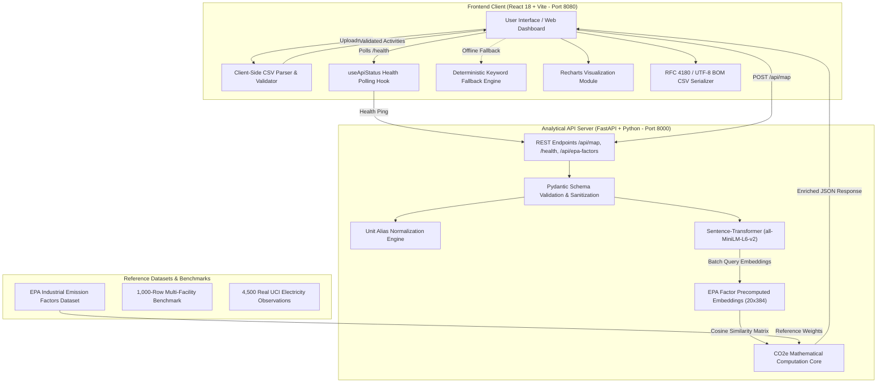
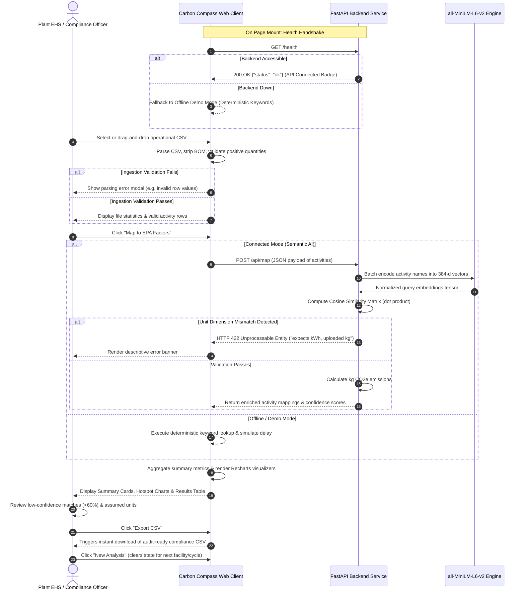

# Carbon Compass: Comprehensive Technical & Market Research Report
**AI-Powered Carbon Emission Calculation & Compliance Reporting for Industrial Manufacturing**

---

## Executive Summary

| Project Metadata | Detail |
| :--- | :--- |
| **Project Name** | Carbon Compass |
| **Core Domain** | Industrial Carbon Accounting, Climate Tech, Automated Regulatory Compliance |
| **Architecture** | Decoupled Client-Server (React 18 + Vite Frontend / FastAPI + Sentence-Transformers Backend) |
| **Embedded Model** | `sentence-transformers/all-MiniLM-L6-v2` (Compact Semantic Embeddings) |
| **Emission Standard** | EPA GHG Emission Factor Framework (20 Industrial Activity Categories Pre-Configured) |
| **Test Datasets** | 1,000-Row Multi-Facility Benchmark + 4,500 UCI Machine Learning Real Observations |
| **Licensing** | MIT License |

---

## 1. Introduction

### 1.1 Project Overview
**Carbon Compass** is an open-architecture, AI-driven carbon accounting system specifically designed to solve the data ingestion, semantic normalization, and compliance reporting bottlenecks faced by modern manufacturing plants. Industrial facilities operate under growing mandates from global and domestic regulatory authorities to submit granular, activity-level monthly Greenhouse Gas (GHG) emission inventories. 

Carbon Compass enables facility managers and Environmental Health and Safety (EHS) officers to upload heterogeneous, unstandardized operational logs in CSV format, automatically maps raw activity descriptions to validated Environmental Protection Agency (EPA) emission factors using semantic vector embeddings, calculates precise Carbon Dioxide Equivalent ($\text{CO}_2\text{e}$) footprints, and produces auditable, export-ready compliance spreadsheets.

```
+-----------------------------------------------------------------------------------+
|                                  CARBON COMPASS                                   |
|                                                                                   |
|  [ Messy Operational Data ]  -->  [ Semantic AI Normalization ]  -->  [ Auditable  |
|  - "diesel for forklifts"         - all-MiniLM-L6-v2 Embeddings       Compliance  |
|  - "plant natural gas burn"       - Cosine Similarity Matching        Report ]    |
|  - "grid electricity kWh"         - Unit & Alias Resolution                       |
+-----------------------------------------------------------------------------------+
```

### 1.2 The Problem Statement
Manufacturing facilities produce greenhouse gases across dozens of discrete and process operations—including stationary combustion, mobile fleet fuel use, heavy process manufacturing (steel, aluminum, concrete, plastics), logistics freight, and high-GWP refrigerant leakage. 

Despite regulatory deadlines, industrial carbon reporting is hobbled by three critical problems:

1. **The Semantic Inconsistency Bottleneck:**
   Plant engineers and procurement personnel log activities using localized shop-floor jargon. One facility writes *"diesel for forklifts"*, another logs *"off-road red diesel"*, and a third records *"internal combustion fuel - yard logistics"*. Traditional relational databases and rule-based regex tools fail on lexical mismatch, requiring hundreds of manual human-hours per reporting cycle to reconcile activity records with standardized emission databases.

2. **Prohibitive Cost and Over-Engineering of Legacy ESG Platforms:**
   Incumbent carbon management platforms (e.g., Watershed, Persefoni) are tailored for Fortune 500 corporations and financial institutions. They feature six-figure annual subscriptions ($50,000–$250,000+/year), require 6–12 month consulting-heavy implementations, and focus predominantly on spend-based estimates rather than activity-based shop-floor physical measurements.

3. **Data Privacy & Operational Air-Gaps:**
   Industrial manufacturers are fiercely protective of operational activity data. Uploading bill-of-materials throughput, facility runtimes, and proprietary chemical inputs to third-party public cloud AI platforms risks leaking trade secrets. Manufacturers require lightweight, auditable, locally hostable software capable of performing semantic mapping on-premise without routing proprietary data through third-party multi-tenant SaaS vendors.

### 1.3 Project Vision
Carbon Compass aims to democratize industrial carbon compliance. By deploying compact, state-of-the-art sentence transformers directly within a lightweight operational pipeline, Carbon Compass delivers automated semantic activity resolution, instant unit normalization, and audit-ready data outputs with zero software licensing costs, sub-second latency, and complete deployment sovereignty.

---

## 2. How It Works

### 2.1 System Architecture
Carbon Compass follows a decoupled, high-performance client-server architecture composed of a React 18 single-page application (SPA) and an asynchronous FastAPI (Python) analytical backend.



### 2.2 Core Modules & Internal Mechanics

#### A. Ingestion & Validation Pipeline (`src/lib/csvParser.ts`)
The client ingestion engine processes tabular operational activity files directly in the browser:
- **Encoding & Header Normalization:** Strips UTF-8 Byte Order Marks (BOM `\uFEFF`), trims whitespace, and normalizes column headers (`activity_name`, `quantity`, `unit`, `facility`, `reporting_period`). It recognizes synonyms (e.g., `qty`, `amount`, `uom`, `site`, `plant`, `month`).
- **Data Integrity Gatekeeping:** Validates that raw rows contain positive, non-zero, finite numeric values ($> 0$), strips empty lines, and aggregates descriptive parsing errors before backend transmission.

#### B. Semantic Vector Mapping Engine (`backend/main.py`)
Rather than relying on brittle dictionary lookups or token-level regex, the backend deploys `all-MiniLM-L6-v2`, a 384-dimensional sentence transformer:
1. **Factor Vector Pre-computation:** At application startup, the 20 EPA factor category descriptions are embedded into a $20 \times 384$ tensor:
   $$\mathbf{E}_{\text{EPA}} \in \mathbb{R}^{20 \times 384}, \quad \|\mathbf{e}_j\|_2 = 1 \quad \forall j \in [1, 20]$$
2. **Batch Query Embedding:** When a user uploads $N$ activity strings, the model embeds all queries in a single vectorized pass:
   $$\mathbf{Q} \in \mathbb{R}^{N \times 384}, \quad \|\mathbf{q}_i\|_2 = 1 \quad \forall i \in [1, N]$$
3. **Matrix Dot-Product Similarity:** Cosine similarity is computed instantaneously via matrix multiplication in NumPy:
   $$\mathbf{S} = \mathbf{Q} \cdot \mathbf{E}_{\text{EPA}}^\top \in \mathbb{R}^{N \times 20}$$
4. **Greedy Factor Assignment & Confidence Scoring:** For each query $i$, the optimal EPA factor index $k$ is selected:
   $$k = \arg\max_{j} \mathbf{S}_{i, j}, \quad \text{Score}_i = \text{round}\left(\text{clamp}(\mathbf{S}_{i, k}, 0, 1) \times 100\right)$$

#### C. Unit Normalization & Cross-Dimensional Guardrails (`backend/unit_validation.py`)
To prevent fatal unit mismatch errors (e.g., multiplying liters of diesel by a factor specified in kilograms):
- Standardizes international and alternate unit representations into canonical tokens (`m3`, `l`, `kg`, `kwh`, `t-km`, `passenger-km`).
- Enforces strict dimension compatibility between the user-uploaded unit and the matched EPA factor unit. If an operator uploads `500 kg` for an activity that resolves to grid electricity (`kg CO2e/kWh`), the API raises a strict `HTTP 422 Unprocessable Entity` error.
- Implements transparent base-unit fallback: If an activity quantity is provided without a unit, the engine adopts the EPA factor's canonical unit and flags `unitAssumed: true` for audit visibility.

#### D. Calculation Core & Analytics Visualization (`src/lib/emissionsAnalytics.ts`, `EmissionsChart.tsx`)
- Calculates granular carbon output:
  $$\text{Emissions} = \text{Quantity} \times \text{Factor}_{\text{EPA}} \quad (\text{kg CO}_2\text{e})$$
- Computes aggregate facility metrics: Total emissions, activity counts, average match confidence, and confidence distribution tiers (High $\ge 80\%$, Medium $60\text{--}79\%$, Low $< 60\%$).
- Generates dynamic visual analytics using Recharts:
  - **Emission Hotspots (Horizontal Bar Chart):** Identifies top carbon-emitting operational centers.
  - **Emission Distribution (Interactive Donut/Pie Chart):** Visualizes the percentage contribution of each industrial activity category to overall facility footprint.

### 2.3 Step-by-Step User Journey



### 2.4 Complete API Specification & Data Contracts

#### Endpoint 1: Health Check
- **Method:** `GET`
- **Route:** `/health`
- **Response:**
  ```json
  { "status": "ok" }
  ```

#### Endpoint 2: Semantic Emission Mapping
- **Method:** `POST`
- **Route:** `/api/map`
- **Request Body (`application/json`):**
  ```json
  {
    "activities": [
      {
        "activityName": "diesel for forklifts",
        "quantity": 1000.0,
        "unit": "L",
        "facility": "Plant 01",
        "reportingPeriod": "2025-01"
      }
    ]
  }
  ```
- **Response Body (`200 OK`):**
  ```json
  [
    {
      "userActivity": "diesel for forklifts",
      "matchedEpaActivity": "Diesel fuel combustion - mobile sources",
      "emissionFactor": 2.68,
      "emissionFactorUnit": "kg CO2e/L",
      "confidenceScore": 89,
      "quantity": 1000.0,
      "quantityUnit": "L",
      "unitAssumed": false,
      "facility": "Plant 01",
      "reportingPeriod": "2025-01",
      "calculatedEmissions": 2680.0
    }
  ]
  ```
- **Error Response (`422 Unprocessable Entity`):**
  ```json
  {
    "detail": "diesel for forklifts expects L, but the uploaded unit is kg."
  }
  ```

#### Endpoint 3: Factor Catalog Lookup
- **Method:** `GET`
- **Route:** `/api/epa-factors`
- **Response Body:** Array of all 20 configured EPA factor objects (`activity`, `factor`, `unit`).

### 2.5 Ingestion Schema & Benchmark Datasets

#### Tabular CSV Specification
| Column Name | Required | Synonyms Accepted | Description |
| :--- | :---: | :--- | :--- |
| `activity_name` | **Yes** | `activityname`, `activity`, `name`, `description` | Colloquial or technical description of activity. |
| `quantity` | **Yes** | `qty`, `amount`, `value` | Finite, positive numeric consumption value ($> 0$). |
| `unit` | No | `units`, `uom` | Physical measurement unit (e.g., `L`, `kWh`, `m3`, `kg`). |
| `facility` | No | `site`, `plant` | Facility or operational center identifier. |
| `reporting_period`| No | `reportingperiod`, `reporting_month`, `period`, `month` | ISO period (e.g., `2025-01`) for monthly tracking. |

#### Empirical Reference Datasets Included in Codebase
Carbon Compass ships with authentic and benchmark datasets located in `public/` and `public/real-data/`:
1. **`demo-emissions-1000.csv`**: A synthetic 1,000-row stress-test covering 20 activity categories across 5 manufacturing plants and 10 reporting cycles.
2. **`real-household-electricity-1500.csv`**: 1,500 measured observations derived from the [UCI Individual Household Electric Power Consumption Archive](https://doi.org/10.24432/C58K54) (1-minute kW converted to kWh).
3. **`real-appliance-electricity-1500.csv`**: 1,500 measured rows from the [UCI Appliances Energy Prediction Archive](https://doi.org/10.24432/C5VC8G) (Wh converted to kWh).
4. **`real-client-load-1500.csv`**: 1,500 measured interval readings from the [UCI ElectricityLoadDiagrams Archive](https://doi.org/10.24432/C58C86) (15-minute kW converted to kWh).
*All datasets can be rebuilt via `python scripts/prepare-real-datasets.py`.*

### 2.6 Pre-Configured EPA Emission Factors Catalog

The application comes pre-loaded with 20 industrial activity factors in `backend/epa_factors.py`:

| # | Industrial Activity Description | Factor Value | Canonical Unit |
| :-: | :--- | :-: | :--- |
| 1 | Steel production - basic oxygen furnace | **1.85** | $\text{kg CO}_2\text{e} / \text{kg}$ |
| 2 | Electricity generation - grid average | **0.42** | $\text{kg CO}_2\text{e} / \text{kWh}$ |
| 3 | Natural gas combustion - industrial | **2.02** | $\text{kg CO}_2\text{e} / \text{m}^3$ |
| 4 | Diesel fuel combustion - mobile sources | **2.68** | $\text{kg CO}_2\text{e} / \text{L}$ |
| 5 | Gasoline fuel combustion - mobile sources | **2.31** | $\text{kg CO}_2\text{e} / \text{L}$ |
| 6 | Concrete production - ready-mixed | **0.13** | $\text{kg CO}_2\text{e} / \text{kg}$ |
| 7 | Aluminum production - primary | **8.14** | $\text{kg CO}_2\text{e} / \text{kg}$ |
| 8 | Paper production - virgin fiber | **1.09** | $\text{kg CO}_2\text{e} / \text{kg}$ |
| 9 | Plastic production - general polymers | **2.53** | $\text{kg CO}_2\text{e} / \text{kg}$ |
| 10 | Road freight transport - heavy truck | **0.21** | $\text{kg CO}_2\text{e} / \text{t-km}$ |
| 11 | Air travel - short haul | **0.15** | $\text{kg CO}_2\text{e} / \text{passenger-km}$ |
| 12 | Rail freight transport | **0.03** | $\text{kg CO}_2\text{e} / \text{t-km}$ |
| 13 | Water consumption - municipal supply | **0.34** | $\text{kg CO}_2\text{e} / \text{m}^3$ |
| 14 | Waste to landfill - mixed municipal | **0.58** | $\text{kg CO}_2\text{e} / \text{kg}$ |
| 15 | Copper production - primary | **3.83** | $\text{kg CO}_2\text{e} / \text{kg}$ |
| 16 | Glass production - container glass | **0.85** | $\text{kg CO}_2\text{e} / \text{kg}$ |
| 17 | Cotton textile production | **5.89** | $\text{kg CO}_2\text{e} / \text{kg}$ |
| 18 | District heating - natural gas boiler | **0.18** | $\text{kg CO}_2\text{e} / \text{kWh}$ |
| 19 | Refrigerant use - HFC leakage | **1430.0** | $\text{kg CO}_2\text{e} / \text{kg}$ |
| 20 | General industrial activity | **1.50** | $\text{kg CO}_2\text{e} / \text{unit}$ |

---

## 3. Key Features

- **Semantic AI Activity Resolution:** Eliminates tedious manual factor lookups by dynamically matching unstructured colloquial activity descriptions to EPA categories using sentence embeddings.
- **Sub-Second Vectorized Processing:** Employs batch vector matrix operations via NumPy to process thousands of operational entries in milliseconds.
- **Cross-Dimensional Unit Validation:** Guarantees regulatory math integrity by strictly enforcing unit compatibility and flagging unstated units.
- **Interactive Visual Hotspot Analytics:** Pinpoints primary emission drivers instantly through responsive Recharts bar and distribution charts.
- **Tri-Tier Confidence Scoring:** Classifies every mapping into High ($\ge 80\%$), Medium ($60\text{--}79\%$), or Low ($< 60\%$) confidence badges, allowing compliance teams to prioritize human verification.
- **Enterprise-Grade Offline Demo Mode:** Operates independently in air-gapped or non-networked environments using client-side deterministic keyword heuristics.
- **One-Click Audit-Ready CSV Export:** Generates standardized, UTF-8 BOM-encoded CSV files directly ingestible by corporate ERP systems, auditors, or national regulatory portals.
- **Built-in Empirical Test Suites:** Ships with 1,000-row synthetic multi-facility benchmarks and 4,500 real-world measured electrical observations (UCI Machine Learning Repository) for robust stress testing.

---

## 4. Technology Stack & Installation Guide

### 4.1 Technology Stack Architecture

| Tier / Component | Technology / Library | Version | Engineering Justification ("WHY Chosen") |
| :--- | :--- | :--- | :--- |
| **Frontend Framework** | **React** | 18.3.1 | Industry-standard declarative component lifecycle; robust ecosystem for complex data-grid interactions and state hydration. |
| **Language (Frontend)** | **TypeScript** | 5.5.3 | Enforces strict compile-time type safety across emission payloads, reducing data transformation bugs in compliance calculations. |
| **Build Tool** | **Vite** | 5.4.2 | Lightning-fast Hot Module Replacement (HMR) and optimized Rollup-based tree-shaking for minimal bundle overhead. |
| **Design System** | **Tailwind CSS + shadcn/ui** | 3.4.1 / Radix UI | Headless accessible primitives coupled with utility-first CSS enabling custom industrial glassmorphism and WCAG-compliant responsive data tables. |
| **Visual Analytics** | **Recharts** | 2.12.7 | Composable SVG-based chart library optimized for React, providing seamless responsiveness and custom-rendered compliance tooltips. |
| **State & API Layer** | **TanStack React Query** | 5.56.2 | Declarative server-state caching, automatic background refetching, and graceful error handling for REST endpoints. |
| **Backend Framework** | **FastAPI** | 0.115+ | High-throughput asynchronous Python framework with native OpenAPI schema generation and lightning-fast serialization via Starlette. |
| **Data Validation** | **Pydantic** | 2.9+ | Robust runtime data parsing, automatic whitespace stripping, type coercion, and strict constraint enforcement on scientific metrics. |
| **Semantic ML Model** | **sentence-transformers (`all-MiniLM-L6-v2`)** | 3.0+ | Compact 80MB footprint, 384-dimensional output, optimized for sub-millisecond inference on commodity CPUs without requiring costly GPU instances. |
| **Numerical Processing** | **NumPy** | 1.26+ | Highly optimized BLAS/LAPACK C-bindings enabling instantaneous matrix multiplication for batch cosine similarity calculation. |
| **Production Server** | **Uvicorn** | 0.30+ | Ultra-fast ASGI web server implementation built on uvloop and httptools. |
| **Database Layer** | **Stateless / In-Memory** | — | Deliberate architectural choice: Zero server-side persistence ensures complete data privacy for proprietary factory production figures. |

### 4.2 Developer Installation & Setup Instructions

#### System Prerequisites
- **Node.js**: v18.0.0 or higher
- **Python**: v3.10 or higher
- **Package Manager**: npm (v9+) or Bun, and pip / conda

#### Step 1: Frontend Deployment
```powershell
# In the carbon-compass root directory
npm install
npm run dev
```
*Frontend runs locally at `http://localhost:8080`.*

#### Step 2: Backend Deployment
```powershell
# Navigate into the backend directory
Set-Location backend

# Create and activate Python virtual environment
python -m venv .venv
.\.venv\Scripts\Activate.ps1

# Install backend dependencies
python -m pip install -r requirements.txt

# Launch FastAPI ASGI server
python -m uvicorn main:app --reload --port 8000
```
*API runs at `http://localhost:8000` with interactive Swagger docs at `http://localhost:8000/docs`.*

#### Step 3: Configuration & Environment Variables
- **CORS Origins:** By default, the API accepts requests from `http://localhost:8080` and `http://127.0.0.1:8080`. To allow custom frontend origins, set:
  ```powershell
  $env:CORS_ORIGINS = "https://app.yourdomain.com,http://localhost:8080"
  ```
- **Execution of Backend Test Suite:**
  ```powershell
  python -m unittest discover -s tests -v
  ```

---

## 5. Market Research & Target Customers

### 5.1 Industry Market Dynamics & Trends
The global carbon accounting software market is entering a phase of explosive structural expansion:

- **Market Sizing & Trajectory:** According to market research by *Research and Markets* (2024) and *Technavio* (2024), the global carbon accounting software market was valued at approximately **$15.3 billion in 2023** and is projected to reach **$63.54 billion by 2030**, reflecting a compound annual growth rate (**CAGR of ~23.1%**). Long-term forecasts from *SNS Insider* (2024) project market capitalization to exceed **$190 billion by 2035** as reporting transitions from voluntary corporate social responsibility (CSR) to legally mandated financial disclosures.
- **Regulatory Catalysts:**
  - **European Union:** The Corporate Sustainability Reporting Directive (**CSRD**) mandates standardized environmental reporting for ~50,000 entities. Concurrently, the Carbon Border Adjustment Mechanism (**CBAM**) forces non-EU manufacturers exporting steel, aluminum, cement, and fertilizers into the EU to report direct and indirect embedded emissions.
  - **United States:** State-level mandates, specifically **California Senate Bills 253 and 261**, mandate Scope 1, 2, and 3 disclosure for multi-facility operations. Furthermore, the EPA Greenhouse Gas Reporting Program (**GHGRP** - 40 CFR Part 98) mandates continuous facility-level monitoring for stationary industrial sources.
  - **Scope 3 and Supply Chain Audits:** Tier 1 enterprise manufacturers are increasingly requiring downstream Tier 2 and Tier 3 SME suppliers to provide auditable carbon invoices to maintain commercial vendor eligibility.

### 5.2 Target Customer Personas

```
+-----------------------------------------------------------------------------------+
|                           TARGET CUSTOMER ECOSYSTEM                               |
|                                                                                   |
|  [ PRIMARY PERSONA ]                [ SECONDARY PERSONA ]                         |
|  Elena Vance                        Mark Henderson                                |
|  Plant EHS & Sustainability Lead     VP of Operations / Plant General Manager     |
|  - Mid-market industrial mfg        - Discrete automotive & industrial equipment  |
|  - Pain: 40 hrs/mo mapping logs     - Pain: Non-compliance fines, lost OEM status |
|  - Goal: Rapid, auditable reports   - Goal: Streamlined factory overhead          |
+-----------------------------------------------------------------------------------+
```

#### Primary Persona: The Environmental Health & Safety (EHS) / Compliance Manager
- **Profile:** Mid-tier manufacturing plant compliance lead responsible for multi-facility environmental reporting.
- **Day-to-Day Pain Points:** Receives decentralized operational logs in disparate spreadsheet formats from plant mechanics, fuel delivery receipts, and warehouse leads. Spends 30–50 hours per month manually looking up emission factors in government PDF tables. Vulnerable to human transcription and unit conversion errors.
- **Core Need:** A zero-friction ingestion tool that can parse internal activity names, calculate emissions according to official formulas, and produce verified spreadsheets ready for environmental agency filing.

#### Secondary Persona: VP of Operations & Supply Chain Director
- **Profile:** Executive managing industrial manufacturing facilities supplying components to global OEMs.
- **Day-to-Day Pain Points:** Threatened with loss of preferred supplier status unless the factory produces activity-level carbon footprints for every component batch. Cannot justify committing $100,000+ to enterprise ESG platforms for simple facility-level compliance.
- **Core Need:** A cost-effective, self-hosted, lightweight software solution that can be integrated into regular monthly closing workflows without ongoing SaaS seat licenses.

#### Tertiary Persona: Independent ESG Auditors & Sustainability Consultants
- **Profile:** Third-party climate accounting consultants servicing hundreds of SME industrial clients.
- **Day-to-Day Pain Points:** Waste billable hours manually sanitizing client-provided CSV files and fixing unit discrepancies.
- **Core Need:** A fast, reproducible batch-mapping engine that standardizes client data into auditable formats in seconds.

### 5.3 Addressable Market Sizing (TAM, SAM, SOM)

| Market Metric | Estimation | Strategic Definition |
| :--- | :--- | :--- |
| **Total Addressable Market (TAM)** | **$63.5 Billion** (by 2030) | Worldwide spending on carbon management, sustainability reporting, and GHG inventory software across all business sectors. |
| **Serviceable Addressable Market (SAM)** | **$9.8 Billion** | Industrial, discrete, and process manufacturing facilities in North America and the EU subject to mandatory environmental compliance (EPA GHGRP, EU CBAM, CSRD). |
| **Serviceable Obtainable Market (SOM)** | **$450 Million** | Small-to-midsize industrial manufacturers (SMEs with 50–2,000 employees) seeking lightweight, self-hostable, or cost-accessible AI-assisted carbon calculation tools without multi-year enterprise lock-in. |

---

## 6. Competitive Advantage

### 6.1 Core Differentiators & Strategic Moats

1. **Semantic Vector Resolution vs. Brittle Lexical Lookups:**
   Legacy Environmental, Health, and Safety (EHS) platforms require exact string matching or rigid dropdown trees. If a plant manager enters *"red diesel for yard cranes"*, traditional tools fail. Carbon Compass leverages continuous vector space representations (`all-MiniLM-L6-v2`) to capture latent semantic intent, mapping colloquial phrasing to formal EPA standards with quantified confidence scores.

2. **Zero-Overhead Local Deployment vs. Expensive Multi-Tenant SaaS:**
   Leading carbon accounting platforms (Watershed, Persefoni) cost upwards of $50,000–$250,000 annually and mandate sharing operational data to third-party multi-tenant clouds. Carbon Compass runs entirely on-premise or within a private cloud VPC on commodity hardware, eliminating software licensing overhead and preventing proprietary operational data leakage.

3. **Activity-Based Bottom-Up Calculation vs. Spend-Based Top-Down Proxies:**
   Many enterprise tools rely heavily on spend-based emission factors (estimating emissions from dollars paid on invoices). In manufacturing, spend-based proxies are notoriously inaccurate due to inflation and volatile commodity pricing. Carbon Compass enforces physical activity calculations ($\text{physical unit} \times \text{emission factor}$), yielding audit-grade inventories.

4. **Instant Time-to-Value (TTV):**
   Enterprise platforms typically require 3–9 months of system integration, enterprise data pipelines, and onboarding consultants. Carbon Compass delivers value in **under 60 seconds**: users drop a CSV file and immediately inspect mapped calculations and visualizations.

### 6.2 Feature Comparison Matrix

| Capability / Metric | **Carbon Compass** | **Watershed** | **Persefoni** | **Greenly** | **Legacy EHS (e.g., Sphera)** |
| :--- | :---: | :---: | :---: | :---: | :---: |
| **Primary Target Market** | Industrial Plants & Mfg SMEs | Enterprise Fortune 500 | Financials & Multi-Nationals | SMBs & Tech Services | Heavy Enterprise Industrial |
| **Deployment Model** | **Local / Private Cloud / Air-Gap** | Multi-Tenant Cloud Only | Multi-Tenant Cloud Only | Multi-Tenant Cloud Only | On-Premise / Hosted Cloud |
| **Annual Starting Cost** | **Open Source / Self-Hosted ($0)** | $50,000 – $250,000+ | $25,000 – $150,000+ | $3,500 – $20,000+ | $40,000 – $120,000+ |
| **Activity Matching Tech** | **Semantic Embeddings (Cosine Sim)** | Proprietary Rule Engine | Guided Manual Ingestion | AI Assistant / Heuristic | Manual Rule Matrix |
| **Time to First Result** | **< 1 Minute** | 3 – 6 Months | 2 – 4 Months | 2 – 4 Weeks | 6 – 12 Months |
| **Physical Unit Validation** | **Automated Alias & Dimension Check** | Supported (Complex) | Supported (Complex) | Basic Validation | Rigid Exact Match Only |
| **Offline / Air-Gapped Mode** | **Yes (Built-in Demo Engine)** | No | No | No | Optional (Legacy Client) |
| **Confidence Scoring** | **Per-row Match Score (0–100%)** | Aggregated Only | Aggregated Only | Qualitative | None |
| **Vendor Lock-in** | **None (MIT Open Standard)** | High (Proprietary Data Model) | High (Proprietary Data Model) | Moderate | Extreme |

---

## 7. Competitor In-Depth Overview

```
+------------------------------------------------------------------------------------+
|                         COMPETITIVE LANDSCAPE MAPPING                              |
|                                                                                    |
|       High Cost ^                                                                  |
|                 |         [ Watershed ]               [ Persefoni ]                |
|                 |     (Enterprise Giants)        (Financial & PCAF Focus)          |
|                 |                                                                  |
|                 |         [ Sphera ]                                               |
|                 |    (Legacy Heavy EHS)                                            |
|                 |                                     [ Greenly ]                  |
|                 |                                  (SMB / Mid-Market SaaS)         |
|                 |                                                                  |
|                 |    * CARBON COMPASS *                                            |
|                 | (Lightweight, Open, Real-time AI)                                |
|        Low Cost +------------------------------------------------------------>     |
|                   Fast / Self-Serve                    Consulting-Heavy / Complex  |
+------------------------------------------------------------------------------------+
```

### 7.1 Watershed
- **Website:** [watershed.com](https://watershed.com)
- **Primary Offering:** Enterprise sustainability management software platform providing end-to-end carbon accounting, climate disclosures, and supply chain decarbonization.
- **Pricing Model:** Custom enterprise contracts typically ranging from **$50,000 to over $250,000/year**.
- **Strengths:** 60+ pre-built enterprise ERP and financial connectors (Workday, SAP, NetSuite); elite carbon data team; pristine investor-facing climate disclosures.
- **Weaknesses:** Highly complex and cost-prohibitive for non-enterprise manufacturers; long onboarding cycles; closed proprietary data architecture.

### 7.2 Persefoni
- **Website:** [persefoni.com](https://persefoni.com)
- **Primary Offering:** Financial-grade climate accounting platform engineered for asset managers, banks, and large corporate enterprises.
- **Pricing Model:** Limited free "Pro" tier for basic carbon estimation; enterprise tiers custom-quoted from **$25,000 to $150,000+/year**.
- **Strengths:** Deep alignment with the Partnership for Carbon Accounting Financials (**PCAF**) and SEC climate disclosure guidelines; audit-grade financial controls.
- **Weaknesses:** Platform design skews heavily toward financial asset calculations and financed emissions; clunky for plant-level manufacturing operations tracking physical raw materials and fuel meters.

### 7.3 Greenly
- **Website:** [greenly.earth](https://greenly.earth)
- **Primary Offering:** SaaS carbon accounting focused on small-to-midsize enterprises, providing streamlined onboarding and carbon footprint reporting.
- **Pricing Model:** Tiered annual subscriptions starting between **$3,500 and $20,000+/year** depending on headcount and emission scopes.
- **Strengths:** Intuitive user experience; strong automated integrations with accounting software (QuickBooks, Xero); lower cost barrier than Watershed.
- **Weaknesses:** Predominantly relies on financial spend data rather than granular physical activity metrics; limited native capability to handle messy, colloquial factory-floor logs.

### 7.4 Normative
- **Website:** [normative.io](https://normative.io)
- **Primary Offering:** Science-based carbon accounting platform paired with dedicated GHG Protocol-certified climate strategy advisors.
- **Pricing Model:** Custom enterprise subscription bundled with expert advisory service hours.
- **Strengths:** Rigorous scientific methodology; strong human-in-the-loop audit verification; tailored for EU CSRD compliance.
- **Weaknesses:** Slower turnaround times due to reliance on human advisory workflows; recurring high advisory fees; less suitable for rapid autonomous monthly plant closing.

### 7.5 Sphera / Cority (Legacy EHS Systems)
- **Website:** [sphera.com](https://sphera.com) / [cority.com](https://cority.com)
- **Primary Offering:** Comprehensive environmental health, safety, and operational risk management software suites.
- **Pricing Model:** High five-to-six-figure enterprise licenses plus hefty implementation and maintenance fees.
- **Strengths:** Deep, decades-long penetration inside chemical, heavy manufacturing, and oil & gas facilities; established compliance with OSHA and EPA Title V permits.
- **Weaknesses:** Antiquated UI/UX; brittle database structures requiring exact string matching; zero modern semantic AI capability; notoriously slow and expensive to update or customize.

---

## 8. Future Scope, Roadmap & Commercialization

```
+-----------------------------------------------------------------------------------+
|                        CARBON COMPASS DEVELOPMENT ROADMAP                         |
|                                                                                   |
|  [ PHASE 1: Near-Term (3-6 Mos) ]                                                 |
|  - Expand Emission Registries (DEFRA, Ecoinvent, IEA)                             |
|  - Automated Regional Grid Factors (eGRID Subregions)                             |
|  - In-Browser Editable Mapping Overrides                                          |
|                                                                                   |
|  [ PHASE 2: Mid-Term (6-18 Mos) ]                                                 |
|  - Direct Industrial Telemetry (SCADA / Modbus / MQTT Connectors)                 |
|  - Scope 3 Upstream Supplier Portal with Automated Parsing                        |
|  - Enterprise Multi-Tenant RBAC & PostgreSQL Persistence Layer                    |
|                                                                                   |
|  [ PHASE 3: Long-Term Vision (18+ Mos) ]                                          |
|  - Fine-Tuned Domain LLM for Decarbonization Recommendations                      |
|  - Cryptographically Verifiable Audit Logs & Zero-Knowledge Attestation           |
|  - Native Mobile Auditing App for Shop-Floor Meter Inspection                     |
+-----------------------------------------------------------------------------------+
```

### 8.1 Short-Term Roadmap (Next 3–6 Months)
- **Multi-Jurisdictional Factor Registries:** Expand factor datasets beyond the core 20 industrial categories to include the complete **US EPA GHG Emission Factor Hub (2024)**, **UK DEFRA/DESNZ**, **IPCC Guidelines**, and **IEA Global Electricity Grid Factors**.
- **Sub-Regional Grid Resolution:** Incorporate US **eGRID subregion** lookups by zip code or facility coordinates to reflect actual local grid carbon intensity (e.g., California CAMX vs. Midwest MROW).
- **Interactive UI Correction Loop:** Allow compliance managers to override an AI match directly in the results table, updating the match and caching the correction locally for future uploads.
- **Multi-Format Ingestion:** Support native Excel (`.xlsx`), JSON, and EDI 810 operational invoice imports.

### 8.2 Mid-Term Roadmap (6–18 Months)
- **Automated IoT & SCADA Telemetry Ingestion:** Implement lightweight connectors to ingest continuous telemetry streams from industrial protocols (MQTT, OPC-UA, Modbus) for real-time boiler fuel and electricity tracking.
- **Relational Persistence Layer & Multi-Tenancy:** Introduce an optional PostgreSQL / TimescaleDB storage layer with multi-facility roll-up dashboards and Role-Based Access Control (RBAC).
- **Automated Scope 3 Supplier Upload Portals:** Generate secure, one-click magic links allowing Tier 2 and Tier 3 suppliers to upload raw activity manifests directly into a facility's Scope 3 ledger.
- **Regulatory Filing Form Templates:** One-click generation of formatted submission templates matching EPA e-GGRT, EU CBAM quarterly XML formats, and ISO 14064-1 compliance dossiers.

### 8.3 Long-Term Vision (18+ Months)
- **Generative Decarbonization Copilot:** Deploy specialized reasoning models (SLMs) that not only calculate historical emissions but recommend actionable engineering interventions (e.g., *"Replacing natural gas boiler #2 with industrial heat pumps will reduce Facility A's annual Scope 1 footprint by 34.2% with an estimated 3.8-year payback period"*).
- **Mobile Edge Auditing Application:** Develop an iOS/Android progressive web app allowing plant technicians to photograph analog utility meters and fuel gauges, using on-device OCR and semantic matching to populate monthly inventories directly from the factory floor.
- **Zero-Knowledge Compliance Attestations:** Utilize zero-knowledge cryptographic proofs allowing manufacturers to prove to enterprise buyers that their products meet carbon intensity thresholds without exposing proprietary bill-of-materials or internal production quantities.

### 8.4 Commercialization & Monetization Framework
While the core computational engine and offline web interface remain open source under the MIT license, commercial monetization avenues include:
1. **Open-Core Managed Cloud (SaaS):** A turnkey hosted version for non-technical EHS teams featuring automated weekly backups, multi-facility consolidated dashboards, and encrypted cloud storage ($199–$499/facility/month).
2. **Enterprise On-Premises Licensing & SLA:** Packaged Docker/Kubernetes helm charts with SOC2 compliance reporting, single sign-on (SAML/Okta), and guaranteed SLA support.
3. **Proprietary Factor Database Subscriptions:** Premium live API connectors to commercial life cycle inventory (LCI) databases such as **Ecoinvent v3.10** and **Gabi/Sphera databases** where commercial redistributions require licensing fees.
4. **Auditor & Consultant White-Labeling:** Multi-tenant consultant portals allowing climate accounting agencies to run bulk client datasets under their own corporate branding.

---

## 9. Assumptions & Verified Limitations

As required by technical reporting standards, the following technical assumptions and current system limitations are explicitly documented:

1. **Emission Factor Provenance Disclaimer:**
   The bundled 20 factor records in `backend/epa_factors.py` represent static demonstration values. In accordance with the explicit warning banner implemented in the user interface, facility managers must verify factor coefficients, vintage years, and geographic boundary applicability against official EPA/state registries prior to formal regulatory submission.
2. **Unit Conversion Capability:**
   The application validates dimension compatibility and normalizes unit aliases (e.g., converting `"liters"` to `"L"`). However, the engine currently does not perform cross-unit dimensional conversions (e.g., converting uploaded British thermal units [BTUs] or gallons into equivalent cubic meters or liters). Activities must match the factor's dimensional unit.
3. **Calibrated Probabilities:**
   Cosine similarity scores returned by the sentence-transformer engine reflect relative geometric proximity in vector space. While presented on a 0–100% scale for user prioritization, they are uncalibrated similarity metrics rather than Bayesian probabilities.

---

## 10. Conclusion

Carbon Compass addresses one of the most persistent, expensive operational bottlenecks in modern environmental compliance: the friction of transforming messy, unstructured shop-floor activity data into verified, audit-ready greenhouse gas inventories. 

By leveraging compact sentence-transformer embeddings (`all-MiniLM-L6-v2`) paired with strict unit validation and zero-configuration web analytics, the system eliminates reliance on multi-month enterprise software deployments and costly external consultants. Carbon Compass delivers a fast, transparent, and self-hostable carbon accounting engine that empowers industrial manufacturers to meet mounting regulatory mandates with mathematical accuracy, complete data privacy, and unprecedented operational velocity.

---
*Report compiled based on verified source files from the Carbon Compass repository and authoritative industry market analyses (Technavio, Research and Markets, SNS Insider, EPA GHGRP documentation).*
